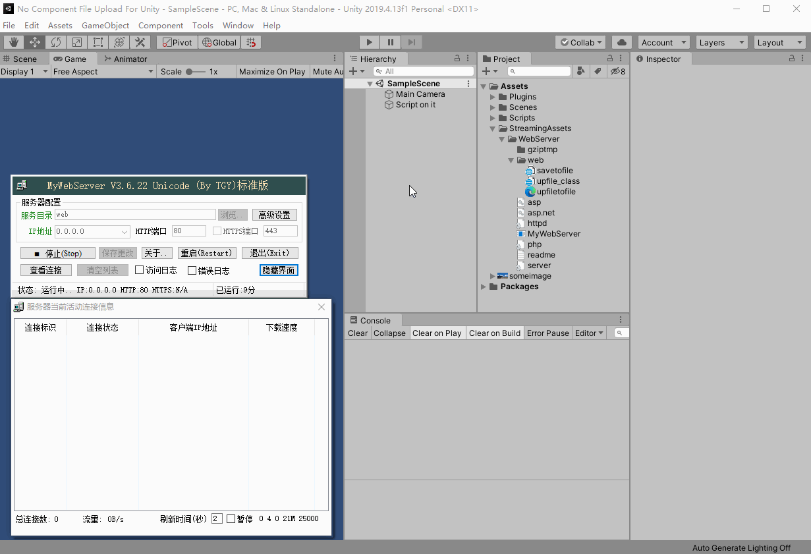

# No Component File Uploader For Unity

这是一个基于无惧上传类修改的 Unity 适配的无组件上传类及其测试工程。

# 功能演示

# Summary

1. UnityWebRequest 在构建二进制上传数据的时候，在二进制头部加入了换行符，这是本无组件上传类适配版面世原因之一
2. 新增指定上传目录的功能，请自己做校验避免用户构建并上传到敏感文件夹

# How to use?

1. Unity 开启工程并点击播放按钮 ，详见 gif 
2. 请确保你的 PC 80端口未被占用（如占用，改 MyWebServer 端口 和 上传 url）

